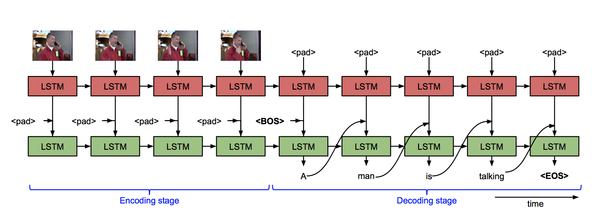
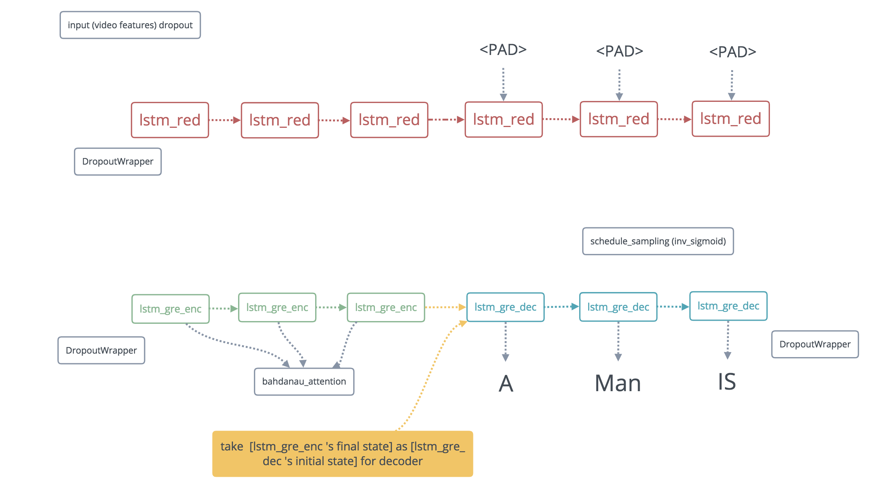
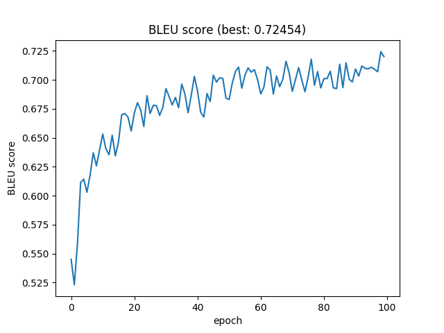

# S2VT 

>  S2VT (seq2seq) video captioning with bahdanau & luong attention implementation in Tensorflow

Based on the open source project written by *cehnxinpeng*. You can access the original version here: [https://github.com/chenxinpeng/S2VT](https://github.com/chenxinpeng/S2VT) .


To access the original paper, **[1] S. Venugopalan, M. Rohrbach, R. Mooney, T. Darrell, and K. Saenko. Sequence to sequence video to text. In Proc. ICCV, 2015**, please click the link : [http://www.cs.utexas.edu/users/ml/papers/venugopalan.iccv15.pdf](http://www.cs.utexas.edu/users/ml/papers/venugopalan.iccv15.pdf)


## Model Structure

Based on the original paper, we take video frames as input in the encoding stage, and after that, in decoding stage, we feed the decoder output ( A, man, is, …) to concat with the red-color LSTM output.



The model structure of our code are shown below. In brief, no only did we implement the original paper, but also we add some extra features like **Bahdanau Attention ( & Luong Attention ), Schedule Sampling and frame/word embedding** in our implementation.




## Experiment Setup

Global Parameters: 

```python
n_inputs        = 4096
n_hidden        = 600
val_batch_size  = 100 # validation batch size
n_frames        = 80 # .npy (80, 4096) 
max_caption_len = 50
forget_bias_red = 1.0
forget_bias_gre = 1.0
dropout_prob    = 0.5
```

Changeable Parameters: (argparse)

```python
learning_rate   = 1e-4
num_epochs      = 100
batch_size      = 250
load_saver      = False # you can use pretrained model if you want
with_attention  = True
data_dir        = '.'
test_dir   = './testing_data'
```


## Version

* Python 3.6.0
* Tensorflow 1.6.0


## Required Packages

You need to pip3 install these packages below to run this code.

```python
import tensorflow as tf # keras.preprocessing included
import numpy as np
import pandas as pd
import argparse
import pickle
from colors import *
from tqdm import *
```


## Best BLEU Score

With bahdanau attention, we achieved **0.72434** for BLEU Score. The block shown below indicates the end of training status and`BLEU_eval.py` output message. You can check the sample output in `output.txt`.

```
Epoch 99, step 95/96, (Training Loss: 2.0834, samp_prob: 0.1235) [4:07:06<00:00, 148.26s/it]
```




## How-to play

1. Download the saver `.ckpt` file, and put it into `saver_best/`
2. Install all required python3 packages through pip3
3. Set up the data path in `demo.sh`
4. run `demo.sh`


## Schedule Sampling

I used `inverse-sigmoid` for my schedule sampling.

```
probs = 
[0.88079708 0.87653295 0.87213843 0.86761113 0.86294871 0.85814894
 0.85320966 0.84812884 0.84290453 0.83753494 0.83201839 0.82635335
 0.82053848 0.81457258 0.80845465 0.80218389 0.7957597  0.78918171
 0.78244978 0.77556401 0.76852478 0.76133271 0.75398872 0.74649398
 0.73885001 0.73105858 0.72312181 0.71504211 0.70682222 0.69846522
 0.68997448 0.68135373 0.67260702 0.6637387  0.65475346 0.64565631
 0.63645254 0.62714777 0.61774787 0.60825903 0.59868766 0.58904043
 0.57932425 0.56954622 0.55971365 0.549834   0.53991488 0.52996405
 0.51998934 0.50999867 0.5        0.49000133 0.48001066 0.47003595
 0.46008512 0.450166   0.44028635 0.43045378 0.42067575 0.41095957
 0.40131234 0.39174097 0.38225213 0.37285223 0.36354746 0.35434369
 0.34524654 0.3362613  0.32739298 0.31864627 0.31002552 0.30153478
 0.29317778 0.28495789 0.27687819 0.26894142 0.26114999 0.25350602
 0.24601128 0.23866729 0.23147522 0.22443599 0.21755022 0.21081829
 0.2042403  0.19781611 0.19154535 0.18542742 0.17946152 0.17364665
 0.16798161 0.16246506 0.15709547 0.15187116 0.14679034 0.14185106
 0.13705129 0.13238887 0.12786157 0.12346705]
```


## References

**[1] S. Venugopalan, M. Rohrbach, R. Mooney, T. Darrell, and K. Saenko. Sequence to sequence video to text. In Proc. ICCV, 2015**

[http://www.cs.utexas.edu/users/ml/papers/venugopalan.iccv15.pdf](http://www.cs.utexas.edu/users/ml/papers/venugopalan.iccv15.pdf)

**[2] Bengio, S., Vinyals, O., Jaitly, N., and Shazeer, N. Scheduled sampling for sequence prediction with**
**recurrent neural networks. In NIPS, 2015.**

[https://arxiv.org/abs/1506.03099](https://arxiv.org/abs/1506.03099)

**[3] Thang Luong, Hieu Pham, and Christopher D. Manning. Effective Approaches to Attention based Neural Machine Translation. In EMNLP, 2015.**

[https://arxiv.org/abs/1508.04025](https://arxiv.org/abs/1508.04025)

**[4] Dzmitry Bahdanau, Kyunghyun Cho, and Yoshua Bengio. Neural Machine Translation by Jointly Learning To Align and Translate. In ICLR, 2015.**

[https://arxiv.org/abs/1409.0473](https://arxiv.org/abs/1409.0473)
